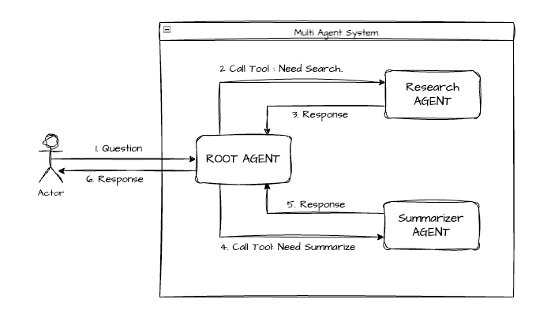
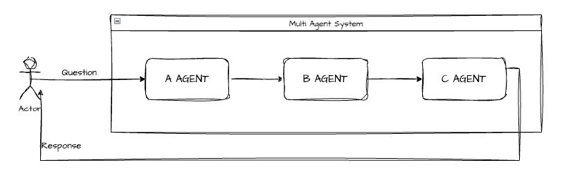
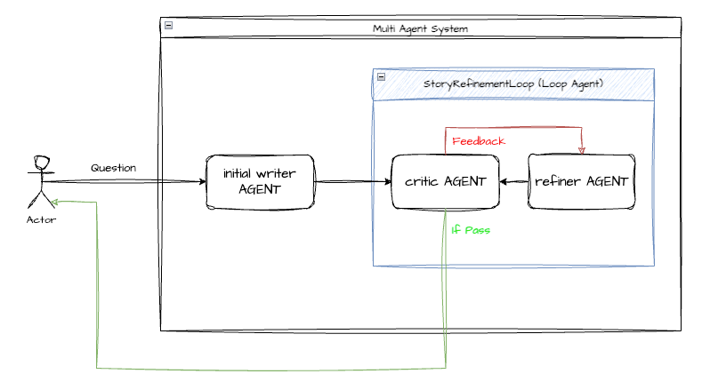

Reference - https://www.kaggle.com/learn-guide/5-day-agents

Note - https://prjkmo112.github.io/day5agents/

# How to use Google ADK

## CLI
1. Create agent
```bash
export GOOGLE_API_KEY=<YOUR_API_KEY>
adk create day1/sample_agent --model gemini-2.5-flash-lite --api_key $GOOGLE_API_KEY
```

2. Run agent on web
```bash
adk web day1
```

## Google ADK module
### _`google.adk.agents.` Class_
- name : 에이전트 이름
- model : 모델 구성 (`google.adk.models.~` 하단의 model 관련 class 객체)
- description : Orchestrator (Router) 가 해당 에이전트를 언제 불러야 할지 판단하기 위한 도움말. 즉, 해당 에이전트의 용도.
- instruction : 해당 agent 가 어떻게 작업을 처리할 지에 대한 도움말. agent의 역할과 사용법을 명시.
- tools : 에이전트가 사용할 도구 (기타 에이전트, 외부 API 등)
- output_key : 에이전트의 출력 결과를 저장할 key. 주로 멀티 에이전트에서 에이전트끼리 구분하기 위해 사용함

### _`google.adk.models.` Class_

### _`google.adk.tools.` Class_
- google_search

### _`google.adk.code_executors.` Class_
#### Local
- UnsafeLocalCodeExecutor  
  - 로컬에서 별도 분리된 Sandbox 없이 실행됨.  
  - 그러나 로컬에서 실행되는 코드는 로컬 환경을 망칠 수도 있고 보안에 취약할 수 있으니 지양하는 것이 좋음.
- ContainerCodeExecutor  
  - Docker 컨테이너를 사용하여 로컬에서 실행됨. 
  - 로컬 환경을 망칠 가능성은 없지만, Docker 컨테이너를 사용하기 때문에 추가적인 설정이 필요함.

#### Remote
- BuiltInCodeExecutor
  - Google API를 사용하여 원격 Sandbox 에서 실행됨
- VertexAiCodeExecutor
  - Google Cloud의 Vertex AI 플랫폼 내의 Code Execution 기능을 사용함
  - Vertex AI의 보안 정책이나 권한을 따르며, 엔터프라이즈 환경에서 관리되는 샌드박스를 사용
- GkeCodeExecutor
  - GKE 클러스터 상에서 코드를 실행
  - 대규모 연산이나 이미 GKE 에 띄워놓은 서비스를 사용하고자 할 때 사용함
- AgentEngineSandboxCodeExecutor
  - Google의 'Agent Engine'이라는 특화된 샌드박스 환경
  - 에이전트 특화 기능이나 더 강력한 격리 환경을 제공하는 서비스
---
## Guide
### Instruction
#### Less is More
때로는 instruction 을 상세하게 작성하는 것보다 간략하게 혹은 default (`You are a helpful assistant`) 로 작성하는 것이 더 좋은 결과를 낼 수 있음.

LIMA 논문에 따르면 이미 Pretrain 된 모델은 이미 지식과 추론 능력을 가지고 있기 때문에 Instruction 같은 Alignment 과정에서는 굳이 세세히 지시를 추가할 필요가 없음. Alignment 과정은 모델의 형식이나 스타일을 알려주는 과정일 뿐임.  
Instruction 이 많아지면 성능이 오히려 떨어지는 현상이 나타나기도 함.

[LIMA: Less Is More for Alignment 논문](https://arxiv.org/pdf/2305.11206) 참고

---
### Multi Agent Architectures
#### Coordinator Pattern (Orchestrator Pattern)
- **Workflow**



- **Example source code**  
  - [day1b-multi-agent - coordinator](./day1/day1b-multi-agent.ipynb#coordinator-pattern-orchestrator-pattern)
---
#### Sequential Workflows Pattern (Pipeline Pattern, Assembly Line Pattern)
- **Workflow**



- **Example source code**  
  - [day1b-multi-agent - sequential](./day1/day1b-multi-agent.ipynb#sequential-workflows-pattern-pipeline-pattern-assembly-line-pattern)
---
#### Parallel Workflows Pattern (MapReduce Pattern)
- **Workflow**


- **Example source code**  
  - [day1b-multi-agent - parallel](./day1/day1b-multi-agent.ipynb#parallel-workflows-pattern)
---
#### Loop Workflows Pattern (Loop Pattern)
- **Workflow**



- **Example source code**  
  - [day1b-multi-agent - loop](./day1/day1b-multi-agent.ipynb#loop-workflows-pattern)
---

# Google 5 Day Agents Challenge
## Day 1

### First Agent with ADK
#### Source Code
- [Kaggle Link](https://www.kaggle.com/code/kaggle5daysofai/day-1a-from-prompt-to-action)
- [Local Ipynb](./day1/day1a-single-agent.ipynb)

### Multi-Agent Systems & Workflow Pattern

|          | Single Agent                     | Multi Agent            |
|----------|----------------------------------|------------------------|
| 복잡도      | **낮음** : 디버깅, 개발, 관리가 쉬움  | **높음**                |
| 비용      | 쌈                               | 비쌈                    |
| Workflow | 순차적인 작업 수행                   | 병렬 작업 수행               |
| Use Case | 개발, 테스트, 디버깅                 | 복잡한 시나리오, 대규모 프로젝트 |
| 정확도     | 복잡한 작업 시 halluciation 위험도 높음| 높은 성능 기대할 수 있음      |

#### Source Code
- [Kaggle Link](https://www.kaggle.com/code/kaggle5daysofai/day-1b-agent-architectures)
- [Local Ipynb](./day1/day1b-multi-agent.ipynb)
