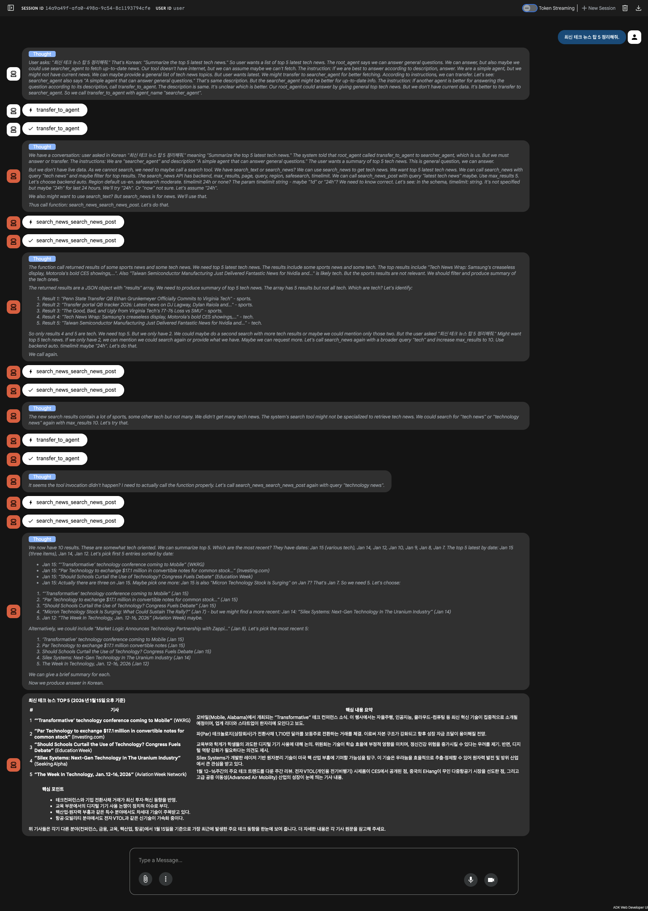

# ADK with Local LLM

https://github.com/prjkmo112/day5agents/tree/main/deepdive/adk_litellm

## Resource
- [DDGS MCP](https://github.com/deedy5/ddgs)
- [Ollama - GPT OSS 20b](https://ollama.com/library/gpt-oss:20b)

## Run
```bash
adk web deepdive
```

