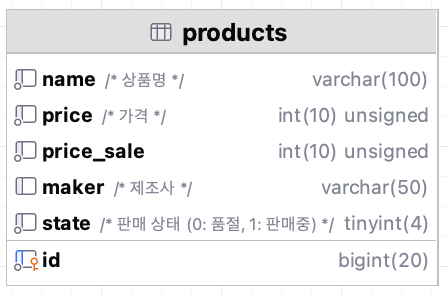
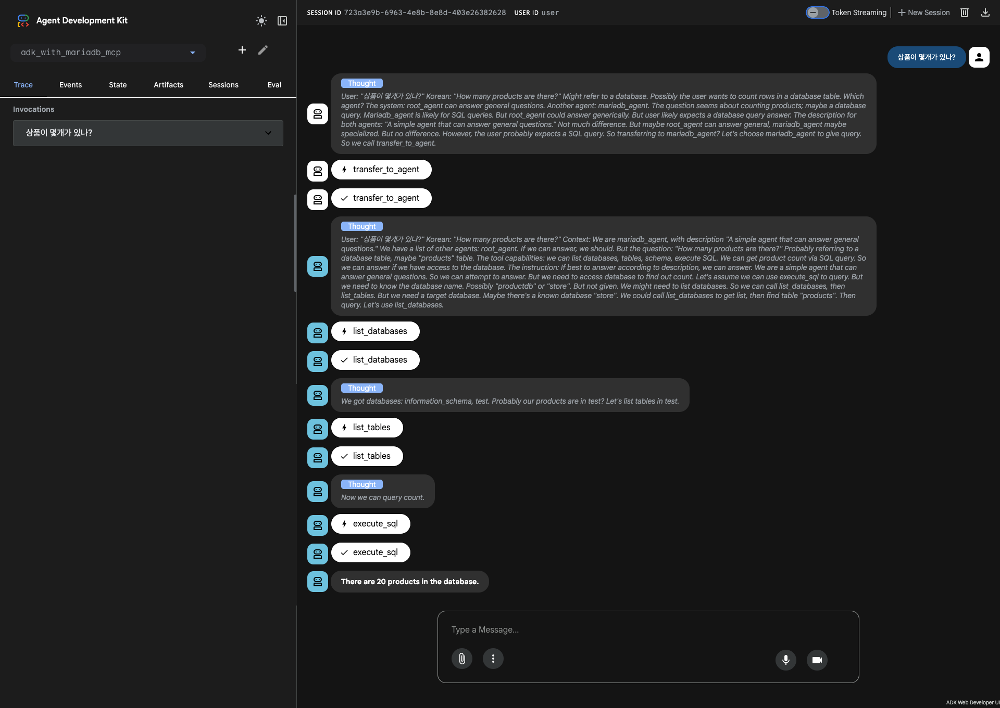

# ADK with MariaDB MCP

https://github.com/prjkmo112/day5agents/tree/main/deepdive/adk_with_mariadb_mcp

## Resource
- [Ollama - GPT OSS 20b](https://ollama.com/library/gpt-oss:20b)
- [MariaDB MCP](https://github.com/MariaDB/mcp)
- [Docker Compose](./docker-compose.yml)

## PreProcess
### Test Product DB
#### Run Docker Compose
```bash
# cd deepdive/adk_with_mariadb_mcp
docker compose up -d
```

#### Test DB Structure


### MariaDB MCP
1. clone project
```bash
# another folder
# cd ~/proj
git clone https://github.com/MariaDB/mcp
mv mcp mariadb-mcp
cd mariadb-mcp
uv lock
uv sync
```
2. create and set up `.env`

   Create a file named `.env` in the `mariadb-mcp` directory and configure the connection
   details for the MariaDB instance started with Docker Compose, for example:

   ```dotenv
   # DB
   DB_HOST=localhost
   DB_PORT=3306
   DB_USER=user
   DB_PASSWORD=passwd
  
   # MCP
   MCP_READ_ONLY=true
   MCP_MAX_POOL_SIZE=10
   ```

3. run server
```bash
uv run src/server.py --transport sse --port 9001 
```

## Process
```bash
adk web deepdive
```

### Ask
상품이 몇개가 있나?



### Debug
ADK Web의 실행결과를 보면 
1. Agent 전환
    - **Thoughts** `상품이 몇 개 있는가`라는 사용자의 질문으로부터 DB 와 연관성을 유추해냈고 mariadb_agent 가 이 작업을 할 수 있음을 알아냈음.  
      따라서 mariadb agent 로 전환해야겠다는 결과를 도출함.
2. MariaDB Agent 의 판단
   - **Thoughts** 상품의 개수를 파악하기 위해 DB 의 row count 를 가져와야 함을 알았음.  
      하지만 DB, table 을 모름. 이에 `list_databases`, `list_tables` 호출을 순차적으로 호출해야 함까지 파악함. 
3. MariaDB MCP 호출 ([`list_databases` tool](https://github.com/MariaDB/mcp/blob/60bad9ef8e2fc549501529bbbca052cead535b2c/src/server.py#L308))
   - **Thoughts** `list_databases` tool 을 호출하여 DB 목록을 가져옴. (information_schema, test) 아마 test 아닐까 유추. `list_tables` 호출해야 함.
4. MariaDB MCP 호출 ([`list_tables` tool](https://github.com/MariaDB/mcp/blob/60bad9ef8e2fc549501529bbbca052cead535b2c/src/server.py#L321))
   - **Thoughts** `list_tables` tool 을 호출하여 테이블 목록을 가져옴. (products) `execute_sql` 호출해야 함.
5. MariaDB MCP 호출 ([`execute_sql` tool](https://github.com/MariaDB/mcp/blob/60bad9ef8e2fc549501529bbbca052cead535b2c/src/server.py#L452))
   - **Thoughts** `execute_sql` tool 을 호출하여 SQL 을 실행함. (SELECT COUNT(*) AS product_count FROM products;) 결과를 가져옴.
6. 응답. (There are 20 products in the database.)

