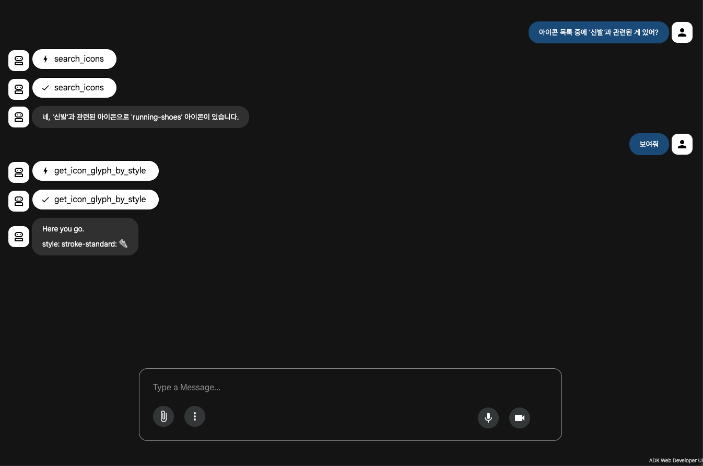
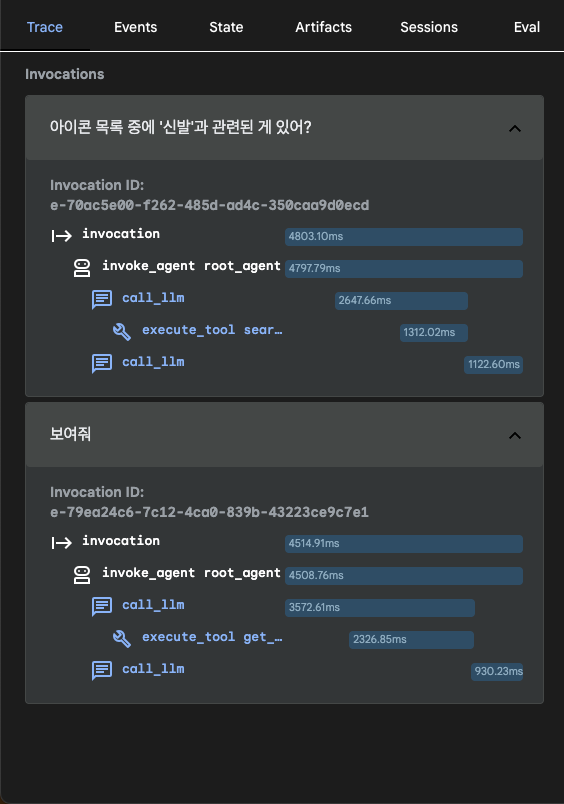
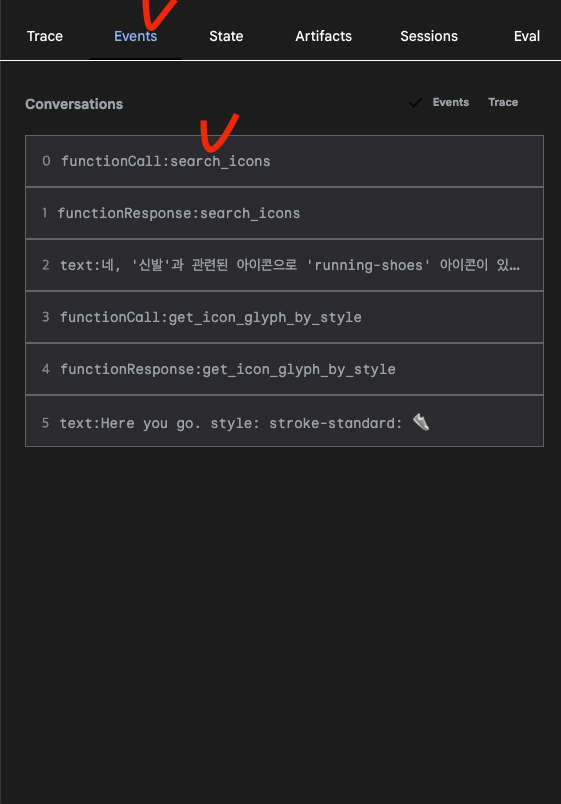
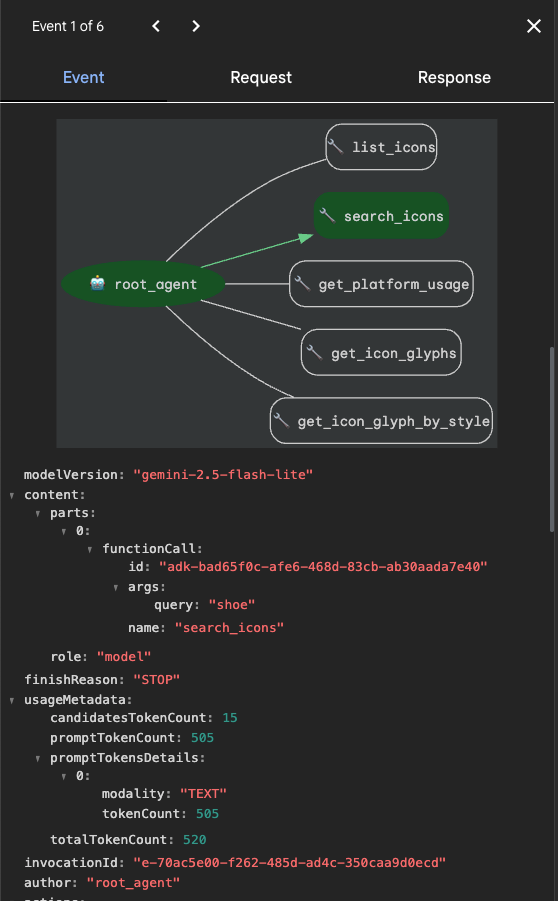

# ADK with MCP

https://github.com/prjkmo112/day5agents/tree/main/deepdive/adk_litellm

외부 MCP 를 도구로써 사용하는 ADK 를 구현

## Use HugeIcons MCP
[How to add mcp on ADK](https://google.github.io/adk-docs/tools-custom/mcp-tools)  
[HugeIcons MCP Github](https://github.com/hugeicons/mcp-server)

```python
MCPToolset(
    connection_params=StdioConnectionParams(
        server_params=StdioServerParameters(
            command='npx',
            args=[
                "-y",
                "@hugeicons/mcp-server"
            ]
        )
    )
)
```

## Run ADK Web
```bash
adk web deepdive
```

### Result


### Debug
각 단계에서 tool 호출 여부 및 순서, request, response 등을 확인할 수 있음






